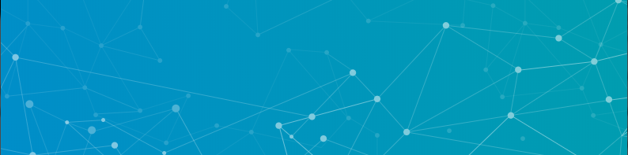

<h1 align="center">
  
</h1>

## Hello, I'm Milhan VERSCHELLE  👋

💼 En formation à la Wild Code School spécialité JavaScript

  <a href="https://github.com/Pimpuss">
  
  

  
 

## Langages 💻

## Contact 📬

<a href="mailto:milhan.verschelle@gmail.com"></img></a>
<a href="https://www.linkedin.com/in/milhan-verschelle-049210177/"></img></a>
